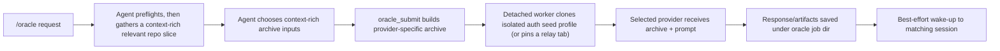

<div align="center">

# OMP Oracle

**Send the hard question to ChatGPT or Grok. Keep working. Read the answer when it lands.**

**Works with Oh My Pi and `pi`. Uses your own ChatGPT or Grok web account, not an API key.**

Keep using [Oh My Pi](https://github.com/can1357/oh-my-pi) or `pi` in your terminal. `/oracle`
packs a context-rich archive of the repository, hands it with your prompt to ChatGPT or Grok in
an isolated browser session, and returns immediately. The answer is saved to disk, and the
session that asked gets one wake-up when it lands.

**[Build and run](#build-and-run)** · **[How it works](#how-it-works)** ·
**[Security model](docs/SECURITY.md)** · **[Compatibility](docs/COMPATIBILITY.md)** ·
**[Website](https://alphastorm.github.io/omp-oracle/)** · **[Changelog](CHANGELOG.md)**

[![CI][ci-badge]][ci]
[![pi baseline][pi-badge]][compat]
[![License][license-badge]][license]

[ci]: https://github.com/alphastorm/omp-oracle/actions/workflows/ci.yml
[ci-badge]: https://img.shields.io/github/actions/workflow/status/alphastorm/omp-oracle/ci.yml?branch=main&label=CI&labelColor=0B0E11
[compat]: docs/COMPATIBILITY.md
[pi-badge]: https://img.shields.io/badge/pi%20baseline-0.80.9-1C232B?labelColor=0B0E11
[license]: LICENSE
[license-badge]: https://img.shields.io/github/license/alphastorm/omp-oracle?color=1C232B&labelColor=0B0E11

<sub><strong>Private by design:</strong> isolated browser profile · your real Chrome untouched by default ·
secrets excluded from archives · results stay on disk · no telemetry</sub>

</div>

> **Forked from [`fitchmultz/pi-oracle`](https://github.com/fitchmultz/pi-oracle) and renamed
> `omp-oracle`.** Commands, tools, config, and saved jobs are unchanged; the fork adds an
> existing-Chrome relay transport and Oh My Pi host compatibility. `pi-oracle` on npm is the
> upstream package and does not carry these changes: install from this repository
> ([below](#build-and-run)) and do not keep both installed.
> [Upstream](docs/UPSTREAM.md) · [exact support and limits](docs/COMPATIBILITY.md).

OMP Oracle is a local-first companion for Oh My Pi and `pi`. The host agent keeps control of
context selection and safety checks; the selected web provider does the slow second-opinion work
asynchronously, in the background, against your real subscription. Status: experimental public
beta. Pi `0.80.9+` is the suggested tested floor for project-trust-aware package/runtime
validation, but pi-bundled runtime packages remain optional wildcard peers so npm peer ranges do
not block newer host releases.

This is a community project and is not affiliated with or endorsed by the Oh My Pi maintainers,
OpenAI, or xAI.

## What a successful run looks like

```text
You: /oracle Review the pending changes. Include the whole repo unless a narrower archive is clearly better.

omp-oracle:
  1. preflights local session/auth readiness
  2. builds a context-rich provider archive (`.tar.zst` for ChatGPT, `.tar.gz` for Grok)
  3. starts an isolated provider web runtime in the background
  4. uploads the archive and prompt to the selected provider
  5. saves the response/artifacts under /tmp/oracle-<job-id>/
  6. sends a best-effort wake-up back to the matching session

Later: /oracle-read <job-id>
```

If the wake-up is missed, the result still lives on disk and can be read by job id.

## Build and run

### 1. Install

On Oh My Pi:

```sh
omp install https://github.com/alphastorm/omp-oracle
```

On `pi`:

```sh
pi install https://github.com/alphastorm/omp-oracle
```

`omp-oracle` is not published to npm yet; `pi-oracle` on npm is the upstream package. If you
already have it, remove it first so `/oracle` and the `oracle_*` tools register once:
`omp plugin uninstall pi-oracle` or `pi remove npm:pi-oracle`. To update a Git install, rerun the
install with `--force` (OMP) or use `pi update --extensions`.

<details>
<summary>Install from a local checkout</summary>

```sh
git clone https://github.com/alphastorm/omp-oracle
omp install ./omp-oracle          # links the checkout as a plugin
pi install -l ./omp-oracle        # pi equivalent
```

For isolated development sessions that load the source without touching your normal agent
state, use the [test plan](docs/TEST_PLAN.md#isolated-pi-session-smoke).

</details>

### 2. Check requirements

- macOS, Linux, or Windows native
- Node.js 22.19.0 or newer for package install/use; platform smoke and release validation expect
  Node 24+ per `platform-smoke.config.mjs`
- Google Chrome, Chromium, or another Chromium-family browser, signed in to ChatGPT or Grok in
  the profile you plan to use
- `agent-browser` and `tar` on the machine; `zstd` for ChatGPT `.tar.zst` archives; on macOS,
  `cp` on PATH or `PI_ORACLE_CP_PATH` for APFS clone mode
- a normal persisted session, not `--no-session`. Start a normal persisted `pi` session (or `omp`
  session) before using `/oracle`
- on Linux, encrypted Chromium cookies may also need `secret-tool` (GNOME/libsecret) or
  `kwallet-query` + `dbus-send` (KDE), unless a safe-storage password override is set for the
  auth run

Exact host, platform, and provider support: [Compatibility](docs/COMPATIBILITY.md).

### 3. Sync provider auth once

```text
/oracle-auth
```

This reads cookies for the configured default provider from your local browser profile and
writes an isolated oracle seed profile; every job clones that seed and never automates your
active browser window. Use `/oracle-auth grok` to refresh the Grok seed when ChatGPT is the
default provider.

Prefer to drive your already signed-in Chrome instead of copying cookies? Set the agent-level
relay option and skip `/oracle-auth` for ChatGPT:

```json
{ "browser": { "chatGptRelayEndpoint": "http://127.0.0.1:9224" } }
```

Each relay job owns one pinned tab and closes it on cleanup. Requirements and behavior:
[Operations → Existing-Chrome relay](docs/OPERATIONS.md#existing-chrome-relay-chatgpt-only).

### 4. Submit a tiny job

```text
/oracle Read README.md and package.json. Tell me in five bullets what this package does and who should not use it.
```

Expected result:

- The `/oracle` prompt now runs an early oracle preflight before expensive repo reading or
  archive creation.
- The agent chooses a context-rich relevant archive up to the selected provider's upload ceiling,
  not the smallest possible one-file slice when nearby context helps.
- `oracle_submit` creates or queues a job.
- If local packing is too large, the prompt treats that as a retryable archive-selection failure
  and narrows automatically before surfacing the problem.
- The job uploads a repo archive to the selected provider, capped at 250 MiB for ChatGPT or
  200 MiB for Grok after default exclusions/pruning.
- The response is saved under `/tmp/oracle-<job-id>/response.md` by default.
- The matching session gets one best-effort wake-up when the job finishes.

If the wake-up does not arrive:

```text
/oracle-status
/oracle-read <job-id>
```

## How it works



- **The host agent owns context gathering.** In the TUI, `/oracle` and `/oracle-followup` are
  intercepted before prompt-template expansion, re-added as compact user messages for
  prompt-history recall, and paired with detailed dispatch instructions as hidden context. The
  visible transcript stays compact while the agent preflights, gathers context, chooses archive
  inputs, and stops after dispatch.
- **Tools own execution.** `oracle_submit` builds the archive, admits or queues the job, starts a
  detached worker, and returns immediately.
- **Auth uses a seed profile, or your Chrome through a relay.** `/oracle-auth` imports cookies
  into an isolated seed profile that each job clones; the opt-in relay drives one job-owned tab in
  your signed-in Chrome instead.
- **Follow-ups preserve provider thread state.** `/oracle-followup <job-id> ...` resolves the
  prior job's saved provider URL and submits the next prompt with `followUpJobId`.
- **Existing ChatGPT browser threads are opt-in.** Normal `/oracle` jobs still start a fresh provider thread.
  When the user explicitly provides a ChatGPT conversation id or `https://chatgpt.com/c/...` URL,
  the agent passes `chatGptConversationId` so `oracle_submit` opens that existing thread in the
  isolated runtime.
- **Wake-up is best effort, storage is durable.** A missed wake-up does not lose the result.

Full detail: [Architecture](docs/ARCHITECTURE.md) · [Security model](docs/SECURITY.md) ·
[Operations](docs/OPERATIONS.md).

## Use it when

- You review broad repository changes before shipping and want a slower, larger second opinion
  that does not block the main agent turn.
- You have a real ChatGPT or Grok subscription and want to use it from the agent instead of
  paying for API tokens.
- Migration, architecture, or failure-mode analysis benefits from a large archive of the real
  code, and you may want to continue the same provider thread later.

## Use something else when

- The task is a short local coding change the host agent can do directly.
- The project must never be uploaded to ChatGPT.com, Grok, or another web provider.
- You need a hosted, multi-user, or API-key-based route; this is a single-operator local tool.

## Commands and tools

User-facing commands:

- `/oracle <request>` — prepare context and dispatch a ChatGPT or Grok web oracle job. If the
  request explicitly includes an existing ChatGPT conversation id/URL, the agent can continue that
  browser-created thread; otherwise `/oracle` starts a fresh thread.
- `/oracle-followup <job-id> <request>` — continue an earlier oracle job in the same provider
  thread.
- `/oracle-auth [chatgpt|grok]` — sync provider cookies into the isolated oracle auth seed
  profile (refused in relay mode; sign in to Chrome instead).
- `/oracle-read [job-id]` — inspect job status and the saved response preview.
- `/oracle-status [job-id]` — inspect a job, or list recent job ids when no explicit id is given.
- `/oracle-cancel <job-id>` — cancel a queued or active job.
- `/oracle-clean <job-id|all>` — remove temp files for terminal jobs; recently woken terminal jobs may stay retained briefly,
  and a blocked cleanup returns the next eligible cleanup time.

Agent-facing tools:

- `oracle_preflight` — readiness check for the persisted session and local prerequisites; runs
  before any expensive context gathering.
- `oracle_auth` — the `/oracle-auth` flow for agents. Agent callers can use `oracle_auth({})` once
  before retrying a stale-auth submission.
- `oracle_submit` — builds the archive and dispatches or queues the job. `chatGptConversationId`
  is optional and only for explicitly continuing an existing ChatGPT browser conversation
  id/URL; omit it for the default fresh thread.
- `oracle_read` — Agent callers can use `oracle_read({ jobId })` to read saved output in-turn.
- `oracle_cancel` — cancels a queued or active job by id.

## Example requests

```text
/oracle Review the current pending changes. Include the whole repo unless a narrower archive is clearly better. Give me a prioritized code review with concrete fixes.
```

```text
/oracle Read the codebase and explain the highest-risk auth/session failure modes, including what to test before shipping.
```

```text
/oracle Explain the README guidance for /oracle-clean retention grace. Archive README.md plus any nearby docs or implementation files that help answer accurately.
```

```text
/oracle-followup <job-id> Tighten the migration plan around rollback risk, and include the most relevant surrounding files/docs as long as the archive stays comfortably within the 250 MiB limit.
```

```text
/oracle Continue existing ChatGPT conversation 6a28ab5c-e4d4-83e8-b8be-dd39f38a26d6. Review the current auth code and include enough surrounding context to propose concrete fixes.
```

## Configuration

Most users can start with defaults. Set the agent-level config only for a non-default
provider, preset, mode, browser profile, or transport:

| Host | Agent-level config | Project overrides (`defaults`, `worker`, `poller`, `artifacts`, `cleanup` only) |
| --- | --- | --- |
| Oh My Pi | `~/.omp/agent/extensions/oracle.json` | `.omp/extensions/oracle.json` |
| `pi` | `~/.pi/agent/extensions/oracle.json` | `.pi/extensions/oracle.json` |

```json
{
  "defaults": {
    "provider": "chatgpt",
    "preset": "<preset id from ORACLE_SUBMIT_PRESETS>",
    "grokMode": "heavy"
  },
  "auth": {
    "chromeProfile": "Default"
  }
}
```

- `defaults.provider` is `chatgpt` or `grok`; `defaults.preset` is the default ChatGPT preset and
  `defaults.grokMode` the Grok mode (only `heavy` today). Canonical ids live in
  [`extensions/oracle/lib/config.ts`](extensions/oracle/lib/config.ts).
- When an agent is unsure which preset fits, it should omit `preset` and use the configured default model
  instead of asking. If the prompt says to use Grok, it passes `provider: "grok"`.
- Project config loads by default for compatibility and is ignored when you opt out with
  `--no-approve` or save a "do not trust" decision; browser and auth settings are agent-level only.
- Linux cookie import uses Sweet Cookie's keyring options (`SWEET_COOKIE_LINUX_KEYRING` and the
  safe-storage password overrides); leave `auth.chromiumKeychain` unset there. macOS users of a
  Chromium-family browser outside the built-in importer pair `auth.chromeCookiePath` with
  `auth.chromiumKeychain`.

Full reference, cookie sources, environment variables, retention, and troubleshooting:
[Operations](docs/OPERATIONS.md).

## Available providers and presets

| Provider | Mode / preset | Archive format | Upload ceiling |
| --- | --- | --- | --- |
| ChatGPT | Presets below | `.tar.zst` | 250 MiB |
| Grok | `heavy` only | `.tar.gz` | 200 MiB |

| Preset id | Label |
| --- | --- |
| `pro_standard` | Pro - Standard |
| `pro_extended` | Pro - Extended |
| `thinking_light` | Thinking - Light |
| `thinking_standard` | Thinking - Standard |
| `thinking_extended` | Thinking - Extended |
| `thinking_heavy` | Thinking - Heavy |
| `instant` | Instant |
| `instant_auto_switch` | Instant - Auto-switch to Thinking Enabled |

For ChatGPT, `oracle_submit` accepts canonical preset ids or a matching human-readable preset label;
keep config values on canonical ids. Grok uploads now use `.tar.gz` archives: Grok may accept
`.tar.zst`, but its execution environment can lack `zstd`, and manual testing found a 200 MiB
upload accepted and 200 MiB + 1 byte rejected.

## Compatibility and known limits

| | Current contract |
| --- | --- |
| Hosts | Oh My Pi and `pi`; `pi` 0.80.9 is the validated upstream baseline. OMP 18.2.6 is observed loading the extension as upstream `pi-oracle@0.7.20` and resolving this checkout as `omp-oracle` (`omp install --dry-run`); no job has run through the fork's build on OMP yet |
| Platforms | macOS and Linux fork-qualified through the Crabbox gate; Windows native declared (`package.json` `os`) and upstream-validated at `pi-oracle` 0.7.20, not re-qualified by the fork; Chromium-family browsers |
| Providers | ChatGPT (presets above), Grok (`heavy`) |
| Transports | Isolated seed profile (both providers); existing-Chrome relay (ChatGPT only) |
| Package | `omp-oracle` from this repository; not on npm yet |

Known limits are part of the claim:

- **Experimental public beta.** Provider UI, auth, model controls, and artifact download
  behavior can drift.
- **Fork changes are not yet matrix-qualified.** The relay transport and OMP host compatibility
  are covered by unit and sanity tests and by observed OMP preflight; the Crabbox platform matrix
  and the ChatGPT preset proof have not been re-run under the `omp-oracle` name.
- **A real ChatGPT or Grok web session is required** for the provider you use.
- **Archives are capped** at 250 MiB (ChatGPT) and 200 MiB (Grok) after default exclusions and
  automatic whole-repo pruning.
- **Wake-up is best effort;** the job directory is the durable record.

The [compatibility matrix](docs/COMPATIBILITY.md) defines the supported boundary; the
[release ledger](docs/RELEASE.md#evidence-ledger) holds the evidence.

## Security model

`omp-oracle` uploads exactly two things per job to the selected provider under your own
account: the prompt and one project archive. Release-blocking invariants:

- archive inputs must resolve inside the project without symlink escapes, and `.git`, tool
  state, `secrets/`, `.env*`, keys, and databases are excluded by default;
- `/oracle-auth` reads your browser cookie store read-only and never launches or mutates your
  real profile; jobs run in per-job clones of an isolated seed that are deleted on exit;
- relay mode copies no cookies, owns exactly one tab per job, and fails closed on a mismatched
  target;
- project config can override only non-privileged keys; browser paths, cookie sources, and the
  relay endpoint are agent-level only;
- job state is written atomically with private permissions, and tool results carry redacted job
  details.

See [the threat model](docs/SECURITY.md) and the [security policy](SECURITY.md).

## Verification

```bash
npm run verify:oracle        # everyday local gate; `npm test` is an alias
```

| Situation | Command(s) |
| --- | --- |
| Everyday local iteration | `npm run verify:oracle` |
| Platform-focused syntax/invariant sanity | `npm run check:platform-smoke`, `npm run sanity:oracle:platform` |
| Platform-sensitive runtime changes | `npm run smoke:platform:doctor`, then a focused `node scripts/platform-smoke.mjs run --target <target> --suite <suite>` |
| Platform matrix proof | `npm run smoke:platform:all` |
| ChatGPT preset release proof | `npm run release:proof:chatgpt-presets` |
| Publish/release gate | `npm run release:check` |

`npm publish` is guarded by `prepublishOnly`, which runs `npm run release:check`: the local gate,
fresh live ChatGPT preset proof for every canonical preset, then doctor-first macOS and Ubuntu
Crabbox evidence from packed installs (Windows native stays an available target, not a required one). Isolated-session smoke tests and the auth
recovery drill are in the [test plan](docs/TEST_PLAN.md); the Crabbox gate is in
[`docs/PLATFORM_SMOKE.md`](docs/PLATFORM_SMOKE.md); the full flow and evidence ledger are in
[Release](docs/RELEASE.md).

## Repository layout

| Path | Purpose |
| --- | --- |
| [`extensions/oracle/index.ts`](extensions/oracle/index.ts) | Extension entrypoint and OMP programmatic bridge |
| `extensions/oracle/lib/` | Commands, tools, config, jobs, queueing, runtime, poller |
| `extensions/oracle/worker/` | Detached provider web worker, auth bootstrap, relay driver, UI helpers |
| `extensions/oracle/shared/` | Shared process, state, job, and observability helpers |
| [`prompts/oracle.md`](prompts/oracle.md) | Hidden `/oracle` command-dispatch workflow |
| [`prompts/oracle-followup.md`](prompts/oracle-followup.md) | Hidden `/oracle-followup` command-dispatch workflow |
| `scripts/oracle-sanity*` | Local sanity harness, including documentation contracts |
| `scripts/platform-smoke*` | Crabbox macOS, Ubuntu, and Windows release smoke gate |
| `site/` | Public website source |
| `docs/` | [Architecture](docs/ARCHITECTURE.md), [security](docs/SECURITY.md), [compatibility](docs/COMPATIBILITY.md), [operations](docs/OPERATIONS.md), [test plan](docs/TEST_PLAN.md), [platform smoke](docs/PLATFORM_SMOKE.md), [release](docs/RELEASE.md), [upstream](docs/UPSTREAM.md) |

## Contributing and releases

The project is developed in public. See:

- [Contributing](CONTRIBUTING.md)
- [Release](docs/RELEASE.md)
- [Upstream](docs/UPSTREAM.md)
- [Security policy](SECURITY.md)

The project has no telemetry, analytics, or hosted control plane.

## Credits

1. **[`pi-oracle`](https://github.com/fitchmultz/pi-oracle)** by Mitch Fultz — the extension this
   fork is built on: the isolated-profile architecture, the job model, the prompts, and the
   validation harness. MIT.
2. **[Oh My Pi](https://github.com/can1357/oh-my-pi)** by can1357 and **[pi](https://github.com/badlogic/pi-mono)**
   by Mario Zechner — the hosts. MIT.
3. **[agent-browser](https://www.npmjs.com/package/agent-browser)** and
   **[`@steipete/sweet-cookie`](https://www.npmjs.com/package/@steipete/sweet-cookie)** — the
   browser driver and the cookie importer.

Sibling projects: [OMP NInfer](https://github.com/alphastorm/omp-ninfer) ·
[OMP Session Gateway](https://github.com/alphastorm/omp-session-gateway).

## License

MIT. See [LICENSE](LICENSE).
